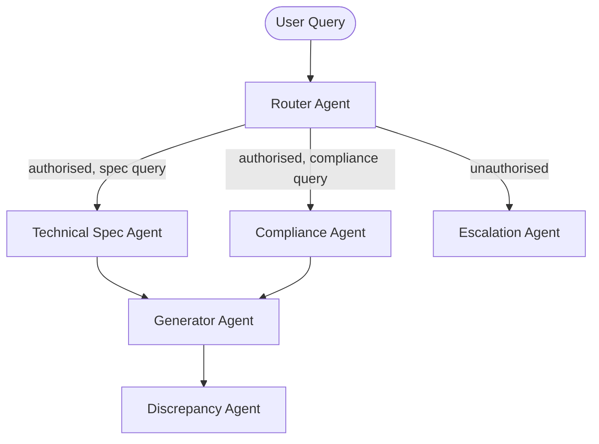

# System Architecture

This document describes the high-level architecture of Project VERA, a multi‑agent AI system for auditing technical documents and enforcing compliance across regulated domains.

## Overview

Project VERA uses a retrieval‑augmented generation (RAG) pipeline with a multi‑agent orchestration framework to detect discrepancies between formal documents (datasheets, SOPs, etc.) and informal communications (emails, change logs). The architecture is domain‑agnostic and can be applied across semiconductor, aerospace, pharmaceutical, and logistics environments.

## Multi‑Agent Workflow

VERA uses LangGraph to define a stateful DAG that routes queries through specialised agents:

| Stage | Component | Purpose |
| --- | --- | --- |
| 1 | **Entry** | Accepts the user query and user role. |
| 2 | **Router Agent** | Classifies intent, enforces high‑level RBAC, and determines which downstream agents should be called. |
| 3a | **Technical Specification Agent** | Retrieves formal documents like datasheets and SOPs from the vector database. |
| 3b | **Compliance Agent** | Retrieves compliance documents (SOPs, regulatory guides) and informal records (emails, change logs) subject to RBAC. |
| 3c | **Escalation Agent** | Handles unauthorised queries or out‑of‑domain requests, returning a structured escalation notice. |
| 4 | **Generator Agent** | Synthesises responses using the LLM, combining retrieved documents with the query context. |
| 5 | **Discrepancy Agent** | Compares formal and informal sources to produce a discrepancy report when conflicts are detected. |

Each agent writes its outputs and metadata into a shared `GraphState` object. Routing decisions can be re‑evaluated iteratively until a stopping condition is met.

## Directed Acyclic Graph (DAG)

LangGraph represents the workflow as a DAG where each node corresponds to an agent and edges represent conditional transitions (e.g., route to Discrepancy Agent if multiple document sources are retrieved). This ensures deterministic execution and facilitates testing.

## RBAC Enforcement

Role‑based access control (RBAC) is enforced at the retrieval layer. Each document in the vector database has metadata fields such as `access_level` and `department`. The router agent first checks if the user’s role is permitted to request the query. When a downstream agent retrieves documents, a filter ensures only those with a suitable `access_level` are returned (e.g., confidential documents are only visible to senior roles).

If a user attempts to access restricted content, the router flags the request and the escalation agent returns a structured message instead of any data.

## Data Flow

Data ingestion is performed by `ingestion.py`, which splits source documents into small chunks, attaches metadata (source, access level, department, document_id, date, domain), generates embeddings via Gemini/Ollama, and stores vectors in ChromaDB. Queries are routed to the appropriate agents, who perform similarity searches against the vector store subject to RBAC filters. The generator agent uses the underlying LLM to craft a response, and the discrepancy agent cross‑checks results for inconsistencies.

## Extensibility

The architecture is modular. Additional agents or new document domains can be added by updating the routing logic and providing appropriate retrieval rules. The back‑end LLM can be swapped via an environment variable. RBAC and logging ensure compliance and auditability across regulated industries.
